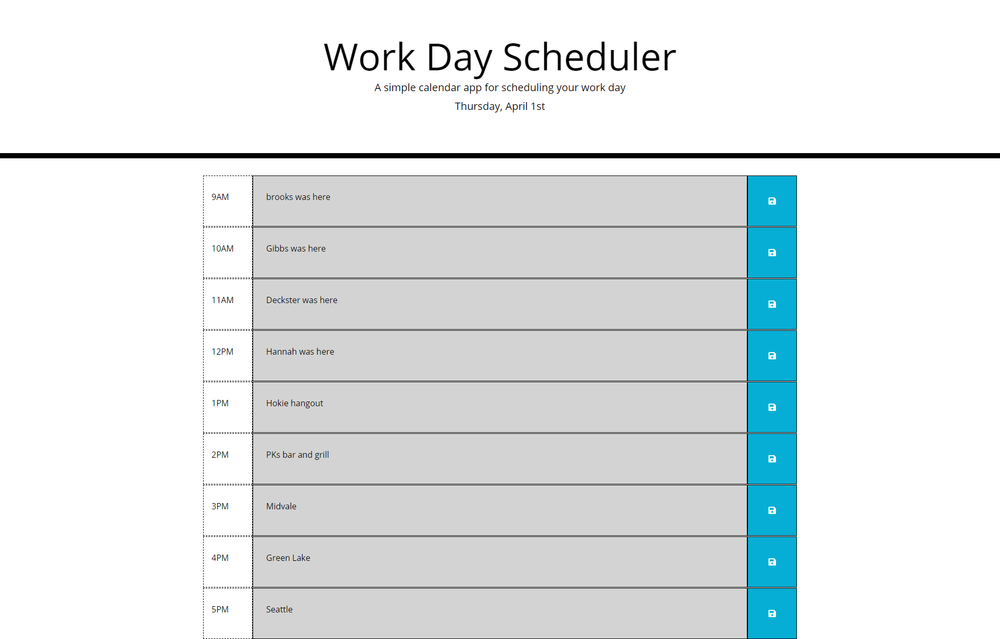

# work-day-scheduler
05  Third Party API's - homework

## description
This was an assignment for the UW Coding Bootcamp. It is meant to demonstrate our ability to use third party api's. This particular project is a "work-day-scheduler" in which you can save events between 9am and 5pm of your day. Events in the past appear grayed out, present appears red, and future blocks appear green. You can save entries by using the blue save button to the right.

Link to project:

